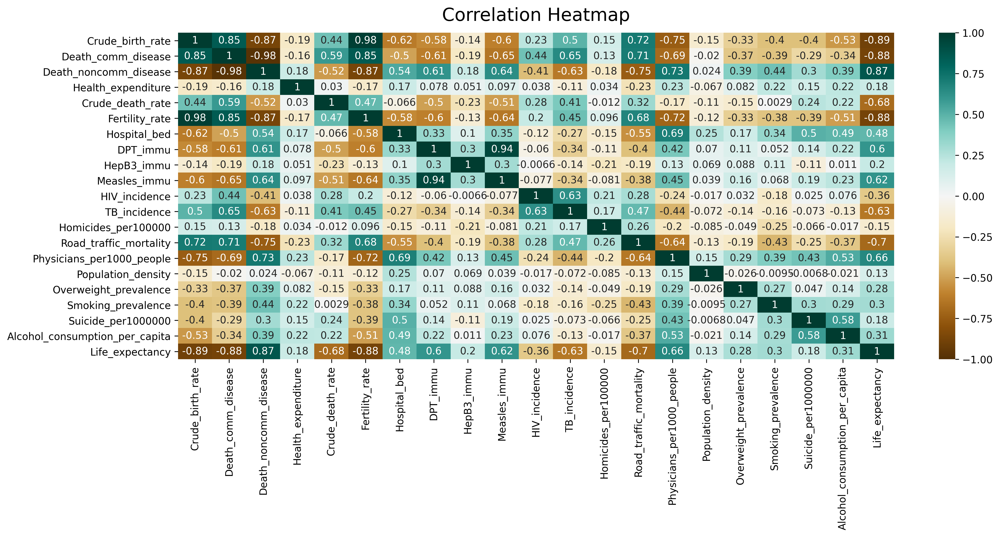
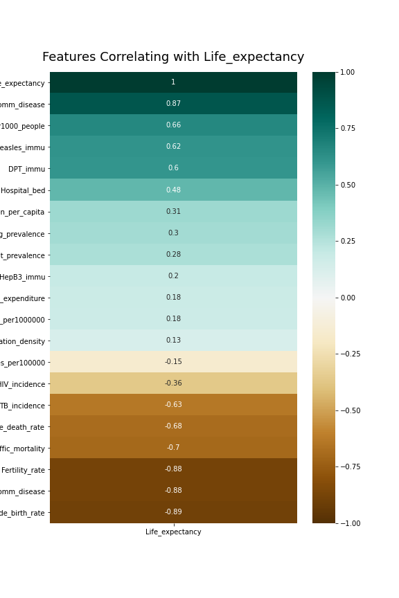
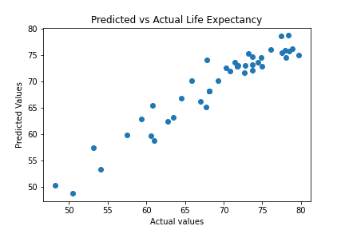
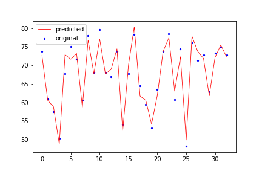

<!---Project Logo -->
 

  

  <h3 align="center">Life expectancy prediction</h3>
  

    A Machine Learning Project
     

<!-- TABLE OF CONTENTS -->
## Table of Contents

* [About the Project](#about-the-project)
  * [Built With](#built-with)
* [Acknowledgements](#acknowledgements)

<!-- ABOUT THE PROJECT -->
## About The Project
Life expectancy refers to the average age a person is expected to live and is one of the key metrics to assess population health of any country.
It is affected by multiple socio-economic factors such as access to healthcare, birth rates, availability of sanitation resources, prevalence of
different communicable and non-communicable diseases.
In this project, I use gradient boosting regression model to predict life expectancy based DPT immunization rate, crude death rate,
road traffic mortality, death rate due to communicable diseases and crude birth rate of the last 35 years.
 
After data cleaning, 20 different variables of interest were identified. The correlation heatmap of those variables against life expectancy is presented below.  

When the selected features were sorted in descending order from the most positive to most negative, I found following result.

Based on these heatmaps, I selected 5 features, DPT immunization rate, crude death rate, road traffic mortality, death rate due to communicable diseases, and crude birth rate to predict life expectancy. 

First, I used linear regression for my prediction and found the following result from my model.

Since, linear regression is pretty basic, I tried to improve the model by using ridge regression and gradient boosting regression to improve the model. 

Gradient boosting regression showed my model prediction vs actual prediction as follows.

Finally, I deployed the gradient boosting regression model using Heroku app [here](https://sd-life-expectancy.herokuapp.com/).

If you would like to run my model locally, please clone the repo in your local machine. Please ensure your python environment satisfies the requirements to run the code as shown in requirements.txt file. 
Then, you can run the app.py locally. App.py will run using flask. 

### Built With
* [Python](https://www.python.org/about/)
  * [pandas](https://pandas.pydata.org/pandas-docs/stable/getting_started/index.html)
  * [matplotlib](https://matplotlib.org/3.3.3/contents.html)
  * [numpy](https://numpy.org/doc/)
  * [openpyxl](https://openpyxl.readthedocs.io/en/stable/)
  * [seaborn](https://seaborn.pydata.org/)
  * [Flask](https://flask-doc.readthedocs.io/en/latest/)
* [HTML](https://developer.mozilla.org/en-US/docs/Web/HTML)
* [CSS](https://developer.mozilla.org/en-US/docs/Web/CSS#:~:text=Cascading%20Style%20Sheets%20%28CSS%29%20is%20a%20stylesheet%20language,on%20paper%2C%20in%20speech%2C%20or%20on%20other%20media.) (work in progress)
* [Scikit-learn](https://scikit-learn.org/stable/)

<!-- ACKNOWLEDGEMENTS -->
## Acknowledgements

**Data sourced from :**

The World Bank. Retrieved from: [https://datatopics.worldbank.org/world-development-indicators/](https://datatopics.worldbank.org/world-development-indicators/)

**Additional reference materials:**

_Best-README-Template_ Retrieved from: [https://github.com/othneildrew/Best-README-Template](https://github.com/othneildrew/Best-README-Template)

